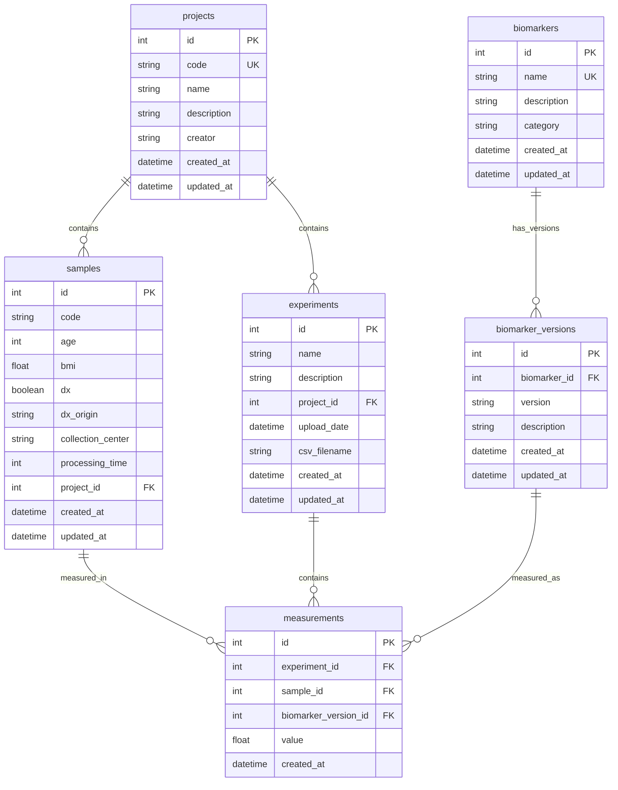

# Architecture & Implementation

## System Overview

MMK-KB is built with a clean, modular architecture following Python best practices and domain-driven design principles.

## Core Architecture

```
┌─────────────────────────────────────────────────────────────┐
│                        CLI Layer                            │
│  ┌─────────────┐ ┌─────────────┐ ┌─────────────────────────┐ │
│  │ Project CLI │ │ Sample CLI  │ │ Experiment CLI          │ │
│  └─────────────┘ └─────────────┘ └─────────────────────────┘ │
└─────────────────────────────────────────────────────────────┘
┌─────────────────────────────────────────────────────────────┐
│                     Business Logic                         │
│  ┌─────────────┐ ┌─────────────┐ ┌─────────────────────────┐ │
│  │   Projects  │ │   Samples   │ │    Experiments          │ │
│  │             │ │             │ │   Biomarkers            │ │
│  │             │ │             │ │   Measurements          │ │
│  └─────────────┘ └─────────────┘ └─────────────────────────┘ │
└─────────────────────────────────────────────────────────────┘
┌─────────────────────────────────────────────────────────────┐
│                    Data Access Layer                       │
│  ┌─────────────┐ ┌─────────────┐ ┌─────────────────────────┐ │
│  │ProjectDB    │ │ SampleDB    │ │  ExperimentDB           │ │
│  └─────────────┘ └─────────────┘ └─────────────────────────┘ │
└─────────────────────────────────────────────────────────────┘
┌─────────────────────────────────────────────────────────────┐
│                     SQLite Database                        │
│           Environment-based file storage                   │
└─────────────────────────────────────────────────────────────┘
```

## Database Schema Design

### Entity Relationships



### Schema Implementation

**Projects Table:**
```sql
CREATE TABLE projects (
    id INTEGER PRIMARY KEY AUTOINCREMENT,
    code TEXT UNIQUE NOT NULL,           -- User-defined identifier
    name TEXT NOT NULL,                  -- Human-readable name
    description TEXT NOT NULL,           -- Project description
    creator TEXT NOT NULL,               -- Project creator
    created_at TIMESTAMP DEFAULT CURRENT_TIMESTAMP,
    updated_at TIMESTAMP DEFAULT CURRENT_TIMESTAMP
);
```

**Samples Table:**
```sql
CREATE TABLE samples (
    id INTEGER PRIMARY KEY AUTOINCREMENT,
    code TEXT NOT NULL,                  -- Sample identifier
    age INTEGER NOT NULL,                -- Patient age
    bmi REAL NOT NULL,                   -- Body Mass Index
    dx INTEGER NOT NULL CHECK (dx IN (0, 1)), -- Diagnosis (0=benign, 1=disease)
    dx_origin TEXT NOT NULL,             -- Diagnosis source
    collection_center TEXT NOT NULL,     -- Collection facility
    processing_time INTEGER NOT NULL,    -- Processing time in minutes
    project_id INTEGER NOT NULL,
    created_at TIMESTAMP DEFAULT CURRENT_TIMESTAMP,
    updated_at TIMESTAMP DEFAULT CURRENT_TIMESTAMP,
    FOREIGN KEY (project_id) REFERENCES projects (id) ON DELETE CASCADE,
    UNIQUE (code, project_id)           -- Unique within project
);
```

**Experiments & Biomarkers:**
```sql
-- Biomarkers: Biological entities
CREATE TABLE biomarkers (
    id INTEGER PRIMARY KEY AUTOINCREMENT,
    name TEXT NOT NULL UNIQUE,          -- Biomarker name (e.g., "IL-6")
    description TEXT,                   -- Biomarker description
    category TEXT,                      -- Category (cytokine, etc.)
    created_at TIMESTAMP DEFAULT CURRENT_TIMESTAMP,
    updated_at TIMESTAMP DEFAULT CURRENT_TIMESTAMP
);

-- Biomarker Versions: Different implementations
CREATE TABLE biomarker_versions (
    id INTEGER PRIMARY KEY AUTOINCREMENT,
    biomarker_id INTEGER NOT NULL,
    version TEXT NOT NULL,              -- Version identifier (RUO, v1.0, etc.)
    description TEXT,                   -- Version-specific notes
    created_at TIMESTAMP DEFAULT CURRENT_TIMESTAMP,
    updated_at TIMESTAMP DEFAULT CURRENT_TIMESTAMP,
    FOREIGN KEY (biomarker_id) REFERENCES biomarkers (id) ON DELETE CASCADE,
    UNIQUE (biomarker_id, version)
);

-- Experiments: Measurement studies
CREATE TABLE experiments (
    id INTEGER PRIMARY KEY AUTOINCREMENT,
    name TEXT NOT NULL,                 -- Experiment name
    description TEXT NOT NULL,          -- Experiment description
    project_id INTEGER NOT NULL,
    upload_date TIMESTAMP DEFAULT CURRENT_TIMESTAMP,
    csv_filename TEXT,                  -- Source CSV file
    created_at TIMESTAMP DEFAULT CURRENT_TIMESTAMP,
    updated_at TIMESTAMP DEFAULT CURRENT_TIMESTAMP,
    FOREIGN KEY (project_id) REFERENCES projects (id) ON DELETE CASCADE
);

-- Measurements: Individual biomarker values
CREATE TABLE measurements (
    id INTEGER PRIMARY KEY AUTOINCREMENT,
    experiment_id INTEGER NOT NULL,
    sample_id INTEGER NOT NULL,
    biomarker_version_id INTEGER NOT NULL,
    value REAL NOT NULL,                -- Measurement value
    created_at TIMESTAMP DEFAULT CURRENT_TIMESTAMP,
    FOREIGN KEY (experiment_id) REFERENCES experiments (id) ON DELETE CASCADE,
    FOREIGN KEY (sample_id) REFERENCES samples (id) ON DELETE CASCADE,
    FOREIGN KEY (biomarker_version_id) REFERENCES biomarker_versions (id) ON DELETE CASCADE,
    UNIQUE (experiment_id, sample_id, biomarker_version_id)
);
```

## Module Architecture

### Core Modules

**`config.py` - Configuration Management**
- Environment detection and switching
- Database path resolution
- Runtime configuration

**`projects.py` - Project Management**
- Project model and CRUD operations
- Database connection management
- Validation and constraints

**`samples.py` - Sample Management**
- Sample model with clinical metadata
- Current project state management
- Cross-project sample operations

**`experiments.py` - Experiment & Biomarker Management**
- Complex domain model with biomarkers, versions, experiments, measurements
- Advanced querying and analysis methods
- Data integrity through foreign keys

**`db_utils.py` - Database Utilities**
- Backup and restore operations
- Environment management
- Database maintenance (vacuum, cleanup)

### Data Processing Modules

**`csv_processor.py` - Experiment Data Processing**
- CSV validation for biomarker data
- Bulk measurement upload
- Sample-biomarker linking
- Error handling and reporting

**`sample_csv_processor.py` - Sample Data Processing**
- Clinical data validation
- Bulk sample creation
- Duplicate handling strategies
- Export functionality

### CLI Architecture

**Modular Command Pattern**
```python
# Base handler interface
class BaseCommandHandler(ABC):
    @abstractmethod
    def add_commands(self, subparsers) -> None:
        pass
    
    @abstractmethod
    def handle_command(self, args, db_path: str) -> bool:
        pass
```

**Specialized Handlers:**
- `ProjectCommandHandler` - Project operations
- `SampleCommandHandler` - Sample management
- `ExperimentCommandHandler` - Experiment and biomarker operations
- `EnvironmentCommandHandler` - Environment switching
- `DatabaseCommandHandler` - Database utilities

**CLI Manager Coordination:**
```python
class CLIManager:
    def __init__(self):
        self.handlers = [
            ProjectCommandHandler(),
            SampleCommandHandler(), 
            ExperimentCommandHandler(),
            EnvironmentCommandHandler(),
            DatabaseCommandHandler(),
        ]
```

## Design Patterns Used

### 1. **Repository Pattern**
Database classes act as repositories, abstracting data access:
```python
class ProjectDatabase:
    def create_project(self, project: Project) -> Project
    def get_project_by_code(self, code: str) -> Optional[Project]
    def list_projects(self) -> List[Project]
```

### 2. **Factory Pattern**
Configuration factory for environment-based setup:
```python
class DatabaseConfig:
    def get_db_path(self, env: Optional[Environment] = None) -> str
```

### 3. **Command Pattern**
CLI handlers implement command interface:
```python
class CommandHandler(BaseCommandHandler):
    def handle_command(self, args, db_path: str) -> bool
```

### 4. **Strategy Pattern**
Different CSV processing strategies:
```python
class CSVProcessor:
    def validate_csv_structure(self, csv_path: str) -> Tuple[bool, str, List[str]]
```

## Key Implementation Details

### Database Connection Management
- **Connection per operation** for thread safety
- **Foreign key constraints enabled** for data integrity
- **Row factory support** for object mapping
- **Transaction management** with context managers

### Error Handling Strategy
- **Validation at input layer** (CLI argument parsing)
- **Business logic validation** (model constraints)
- **Database constraint enforcement** (foreign keys, unique constraints)
- **Graceful error reporting** with user-friendly messages

### Environment Isolation
- **File-based database separation** by environment
- **Runtime environment switching** via configuration
- **Consistent path resolution** across modules
- **Environment-specific operations** (backup, restore)

### Data Integrity Features
- **Cascading deletes** for hierarchical data
- **Unique constraints** for business rules
- **Check constraints** for data validation
- **Timestamp tracking** for audit trails

## Performance Considerations

### Database Optimization
- **Indexes on foreign keys** for join performance
- **Composite unique constraints** for business rules
- **VACUUM operations** for space reclamation
- **Query optimization** with proper WHERE clauses

### Memory Management
- **Streaming CSV processing** for large files
- **Connection pooling** via context managers
- **Lazy loading** of related objects
- **Pagination support** for large result sets

## Testing Architecture

### Test Structure
- **Unit tests** for individual modules
- **Integration tests** for CLI operations
- **Database tests** with temporary databases
- **CSV processing tests** with sample data

### Test Isolation
- **Separate test environment** (`test_mmk_kb.db`)
- **Cleanup utilities** for test databases
- **Mock data generation** for consistent testing
- **Transaction rollback** for test isolation